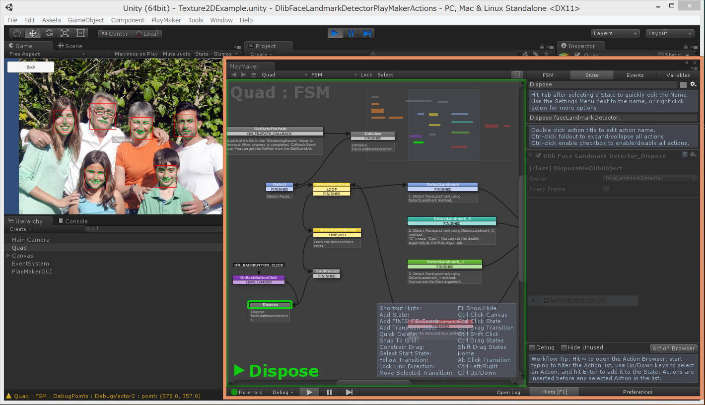
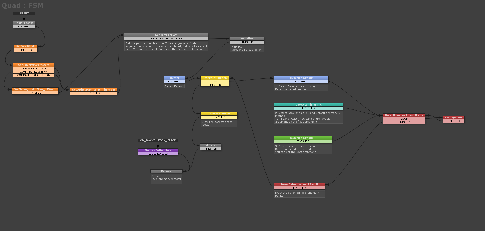
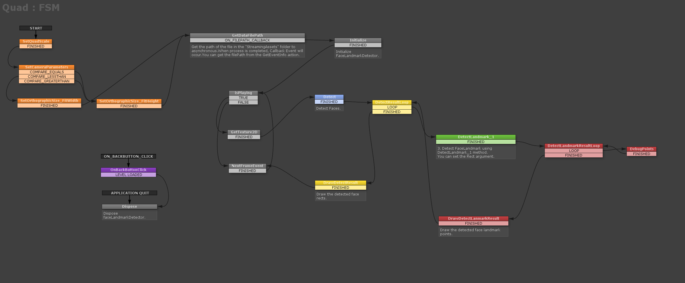
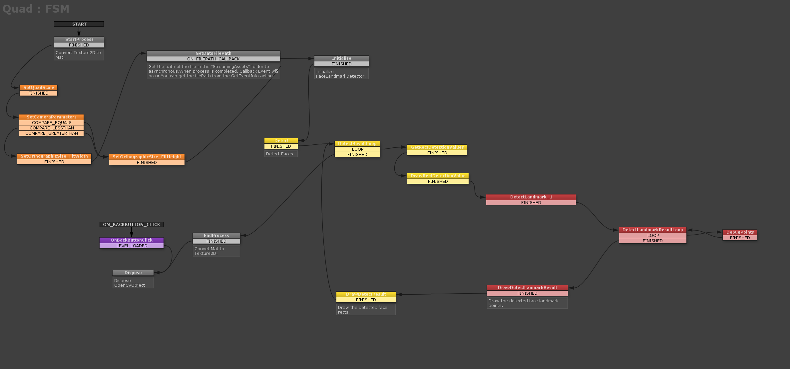
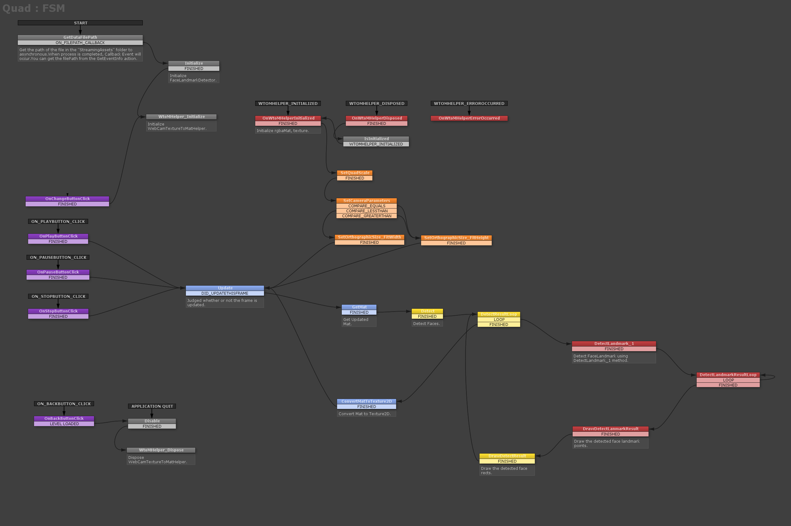
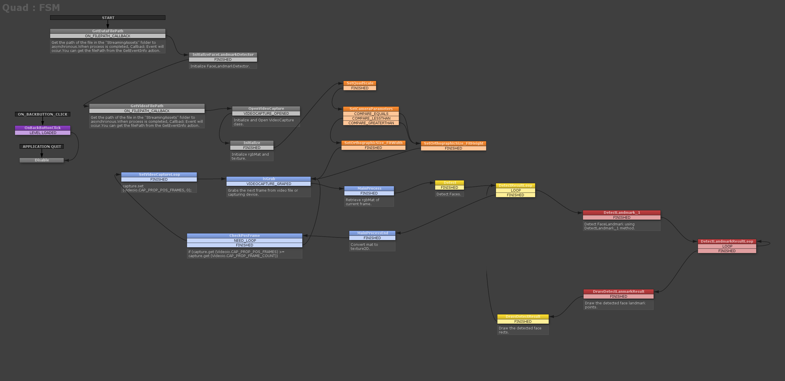

PlayMakerActions for DlibFaceLandmarkDetector
====================

Overview
-----
[https://assetstore.unity.com/packages/tools/visual-scripting/playmakeractions-for-dlibfacelandmarkdetector-95863](https://assetstore.unity.com/packages/tools/visual-scripting/playmakeractions-for-dlibfacelandmarkdetector-95863?aid=1011l4ehR)

Environment
-----
[DlibFaceLandmarkDetector](https://assetstore.unity.com/packages/tools/integration/dlib-facelandmark-detector-64314?aid=1011l4ehR)  
[Playmaker](https://assetstore.unity.com/packages/tools/visual-scripting/playmaker-368?aid=1011l4ehR)

Manual
-----
[ReadMe.pdf](/Assets/DlibFaceLandmarkDetectorPlayMakerActions/ReadMe.pdf)

